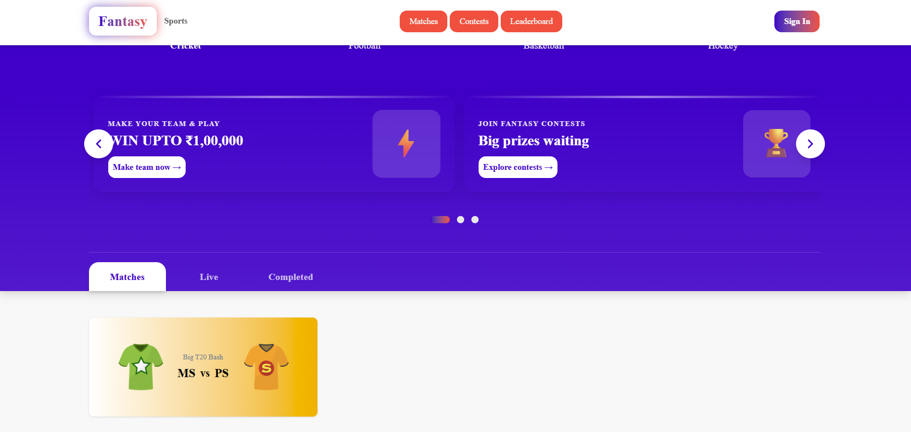
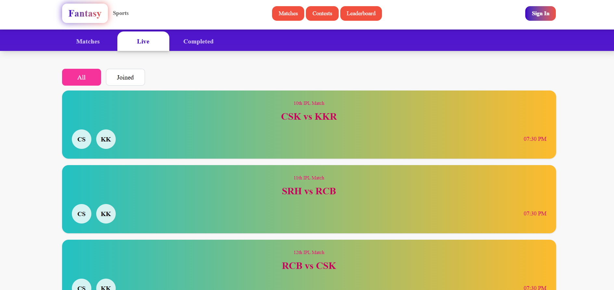
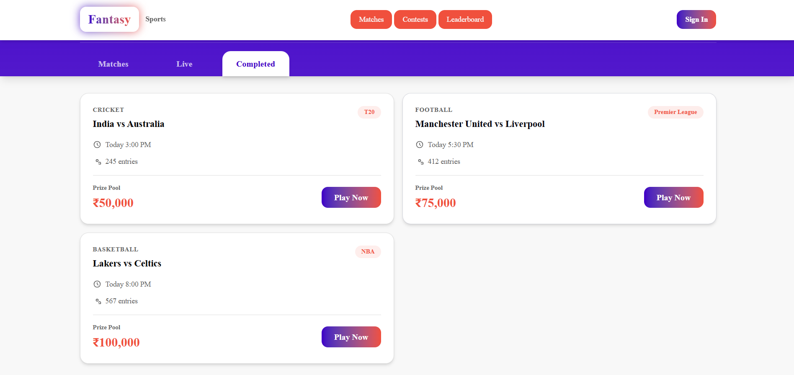
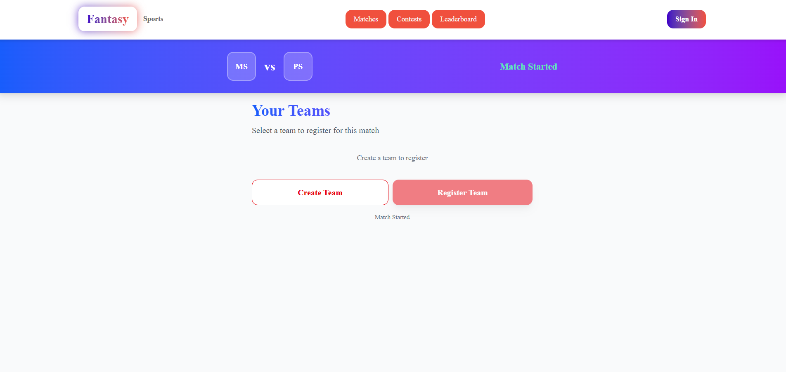
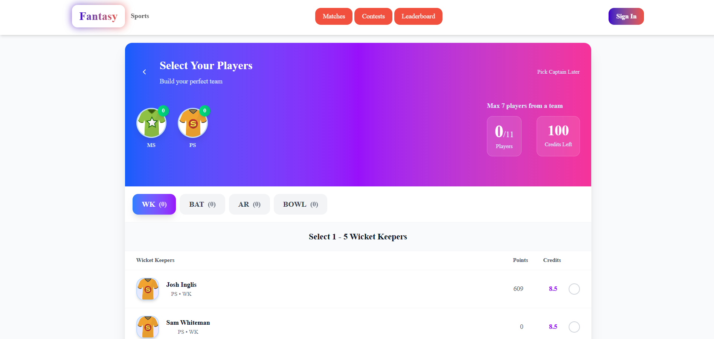
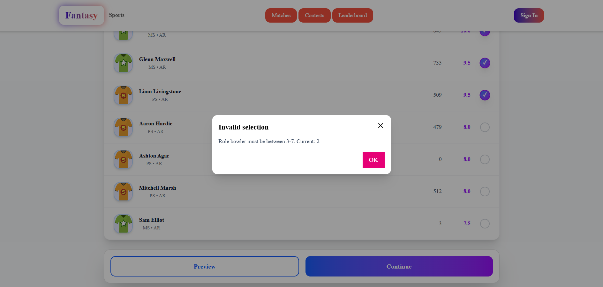
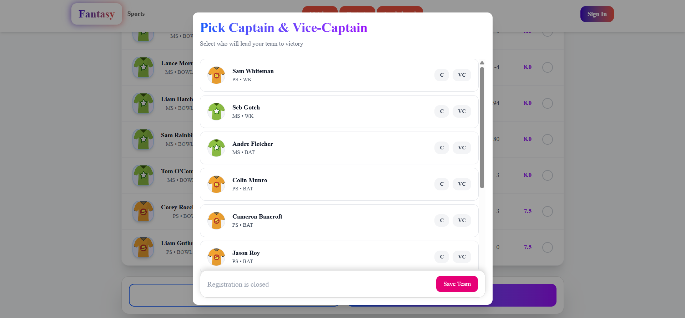
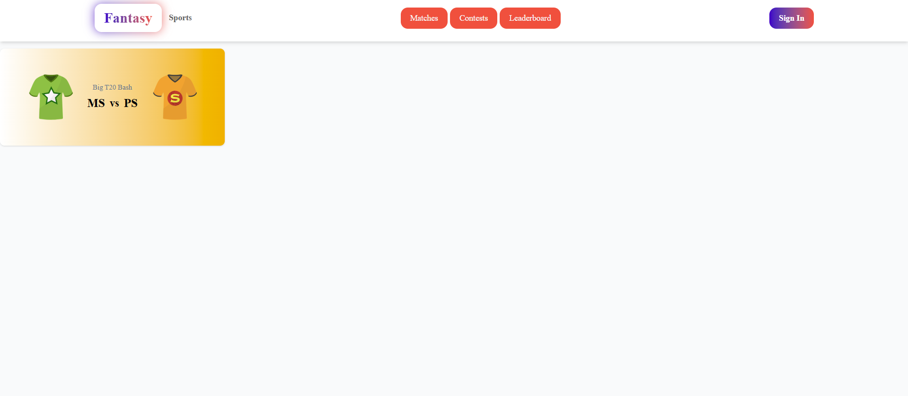

# 🏆 Fantasy Sports – React + Vite (Frontend Assessment Project)
A Fantasy Sports Web Application built as part of a company assessment. Users can browse upcoming matches, create multiple fantasy teams, select players under constraints, and assign captain/vice-captain roles — just like real fantasy sports apps.
## This project is fully built using:
- ⚛️ React + Vite
- 🎨 Tailwind CSS
- 🧠 JavaScript
- 📡 REST API integrations for matches & player data

## 🚀 Features
### 📝 1. Match Selection
- Fetch & display upcoming matches
- User can pick any match to create teams

### 🧑‍🤝‍🧑 2. Team Creation
- User can create multiple teams per match
- Player listing with roles (Batsman, Bowler, WK, All-rounder)
- Dynamic credit system

### ⚖️ 3. Team Formation Rules
Each team must follow strict fantasy sports rules:
- ✔️ Team Size Rule
A total of 11 players per team
- ✔️ Team Combination Rule
Max 7 players from a single real team
- ✔️ Credits Rule
100 Credits per team
Player selection updates remaining credits in real-time
- ✔️ Role-based Restrictions
| Role               | Allowed Range |
| ------------------ | ------------- |
| Batsman (BAT)      | 3 – 7         |
| Wicket Keeper (WK) | 1 – 5         |
| All Rounder (AR)   | 0 – 4         |
| Bowler (BOWL)      | 3 – 7         |
- ✔️ Captain & Vice Captain
User can choose Captain
User can choose Vice Captain
Only allowed when all rules are met

## 🛠️ Tech Stack
| Technology                | Purpose                            |
| ------------------------- | ---------------------------------- |
| **React + Vite**          | Fast, modern frontend setup        |
| **Tailwind CSS**          | Efficient and responsive styling   |
| **JavaScript (ES6)**      | Logic and state management         |
| **React Icons**           | Icons for UI                       |
| **Environment Variables** | Secure API handling using `VITE_*` |

## ✨ Screenshots

